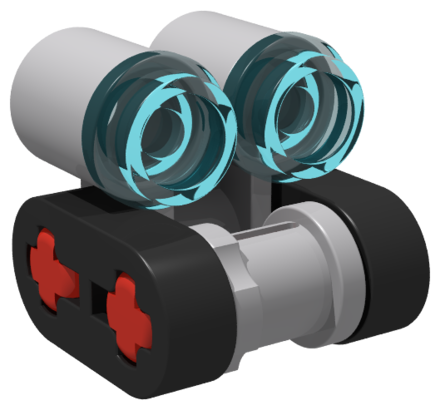

<p align="center">
  
</p>

# Klods - A Brick Collection Manager 

Welcome to Klods. It's a tool to track your LEGO sets, the bricks you need, the bricks you have, move inventory between sets, link to the official instructions, and inform you what pieces you needed to buy.

It's open source under the MIT license, so if you want to fix my late-night, alcohol-fueled, sleep-deprived, "what if I did this" code, please do. I'll check PRs if there are any.

### Features

**Inventory**

- Track a personal inventory of loose bricks.
- Tracks the bill of materials for each set and allows you to denote what pieces you have for each set. If you need eight technic axles, but you only have seven, it will mark how many pieces you're missing.
- Allow a user to have more than one of the same set, each with their own inventories.
- Allow the user to move stock from the loose inventory to the set stock.
- Bulk brick actions per set copy — mark a whole build complete, tear it down back into your loose inventory, or auto-fill it from loose stock, all in one click instead of piece by piece.
- When looking at a brick, you can see how many you need, how many you have, and which sets need that brick and how many it needs.
- Track minifigs the same way as bricks, owned and needed, and see which sets need them.

**Catalog & data**

- Pulls data from Rebrickable on-demand and stores it locally so that you only use an API call as needed.
- Ability to upload bulk data sets from Rebrickable to avoid the need to use an API key for every set.
- RSS feed to keep track of new sets and updates from Rebrickable and automatically import them.
- Search, sort, and filter the brick, minifig, and set catalogs.
- Export your parts list to CSV or XLSX, optionally filtered to only the pieces you're still missing. The XLSX embeds part images and tints each colour cell to the actual brick colour, so it doubles as a printable shopping list.
- Link directly to the instruction on LEGO's official instructions.

**Users & auth**

- User authentication via Discord, Microsoft, Google, and plain ol' email/password.
- Multiple users can have their own inventories and track their own stock.
- Admin panel to manage system settings.
- Admins can require new registrations to be approved before they get access, or leave auto-approve on.
- Customize KL-0D5, your own Klods bot — 11 chassis colours, 9 eye colours, and your browser tab icon updates to match.

**Self-hosting**

- Fully self-hosted. As much as I'd love to make money on a side project, I care a lot more about providing my talents to the open source community when possible.
- Relatively easy to build and deploy with Docker Compose (thanks dad).
- Stores data in a postgres database, which makes it easy to look at the data and fix things if needed.
- It's neat (I am not biased).

[//]: # (### Screenshots)

[//]: # ()
[//]: # (<!-- Drop the images into docs/screenshots/ with these names and they'll show up here. -->)

[//]: # ()
[//]: # (| | |)

[//]: # (|---|---|)

[//]: # (| ![Set list]&#40;docs/screenshots/sets.png&#41; | ![Set bill of materials]&#40;docs/screenshots/set-bom.png&#41; |)

[//]: # (| ![Brick catalog]&#40;docs/screenshots/bricks.png&#41; | ![Loose inventory]&#40;docs/screenshots/loose-inventory.png&#41; |)

### Deploy (recommended — published images)

Runs the prebuilt images from GitHub Container Registry — no cloning or compiling.

1. Download [`compose.ghcr.yaml`](compose.ghcr.yaml) and [`.env.example`](.env.example) into the same folder.
2. `cp .env.example .env` and fill in the values (required ones are marked in the file).
3. `docker compose -f compose.ghcr.yaml up -d`

Or paste `compose.ghcr.yaml` into a **Portainer** stack and set the same variables under the stack's *Environment variables*.

**First run:** an admin account is created — username from `ADMIN_USERNAME` (default `admin`). If you left `ADMIN_DEFAULT_PASSWORD` blank, a random password is printed **once** to the logs:
```
docker compose -f compose.ghcr.yaml logs klods_api | grep "generated password"
```
Sign in, change it in-app, then run the catalog bulk import to populate sets/parts/minifigs. (Setting `ADMIN_DEFAULT_PASSWORD` *after* first boot won't change an existing admin — rotate it in the app.)

### Build from source (development)

Clone the repo, `cp .env.example .env` and fill it in, then `docker compose up -d` — this builds the images locally from the Dockerfiles instead of pulling them.

### Why?

I started collecting LEGO when I was like 3 or 4 years old. I can distinctly remember coming out to our apartment living room one Christmas and seeing Santa left me Watto's Junkyard (7186), the Podracing Bucket (7159), and Anakin's Podracer (7131), fully assembled, ready to play.

Since then, between my brother and me, we've collected over a hundred LEGO sets. We built most of them, tore apart all of them, lost hundreds of pieces, gathered random pieces left by friends, and left them all in a big tub with no organization.

In college, I went back to visit my parents during one of the breaks, and I had the idea to try and rebuild all of my old sets. I ended up building a few of them but noticed a few of the brick colors seemed off. I didn't care at first, until I realized that some time in the last 20 or so years, LEGO changed the color of gray. That meant I had to tear apart all the sets and start over, and I was too lazy, so I left them semi-organized in some tubs, and I didn't think about them again.

Over the next few years, my parents would gift me LEGO sets, I'd build them at their house, and then I'd go back to college. Eventually, I moved a few states away, brought a few of the sets I had built that I particularly enjoyed, and then every birthday, Christmas, and even Easter, they'd send me another one.

At some point, I thought a bit about those old sets, and I wanted to try again and rebuild them. In 2024, my wife and I drove 1100 miles for Christmas with my end goal being to bring every brick home, organize them, sort them into bags for sets, and then send my brother back his sets, and display mine.

I looked around and found a few websites that allowed you to track your sets, even track your bricks, but none of them did quite what I was wanting. Rebrickable is great, but it tracks the sets you have and allows you to add the bricks, but it didn't seem to have an intuitive way to say "I have four of this brick, and I need five across two sets, so I'll put three on one and one on the other." Brickset was similar in that it works really well to track your sets but not to track the bricks you have and need. Nothing against either of these two sites, they're both great, but they didn't quite do what I wanted in the way I wanted.

So, my dad and I, having a bunch of free time while off work for the end of the year, started building this little thing to fulfill my own personal needs, even if no one else cared.

### Who's the little robot?

That's KL-0D5. He's a little robot. Many, many years ago, my brother and I watched WALL-E, which was a great movie. After that, we wanted our own little robot. At some point, one of us found 8 little pieces and slapped them together.

#### What makes up a KL-0D5? 
- First, you need a body, which is a 32291 technic perpendicular connector, and a 3713 front-bushing. Both should be the same color, but you can use whatever you want, I'm not your dad. Ours were generally black or light bluish gray.
- Second, you need two tread pieces made up of 41677. We used to do either black or white.
- Third, you need the two axles to bind it all which is two 32062 pieces. We used both red and black, but red was more common in our house.
- Fourth, you need his eyes, which is two 6141 studs. They gotta be translucent, and we mostly used the light, neon orange color, or the red one.

#### Why is KL-0D5? 
I was looking for a mascot and I saw Rebrickable had their little robot guy, and I was suddenly reminded of this guy, so I went with it because I thought it would be fun. I did a new version to make him a bit more modern with cleaner colors. It's an entirely useless feature that absolutely puts code that means nothing to the actual usability. But it's fun and I like it so I did it.

#### How do you know he's a he?
Just look at him, he's just a lil guy.

[](https://www.buymeacoffee.com/tLewis1028)
